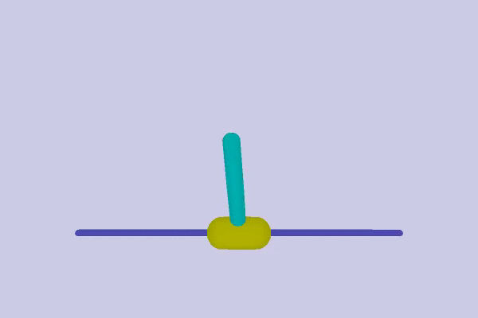

# Homework2 from CS 294-112 at UC Berkeley:
I implemented REINFORCE with Neural Network Baselines and the "reward_to_go" optimization.

I used it to solve the "Inverted Pendulum" environment from OpenAi Roboschool.

