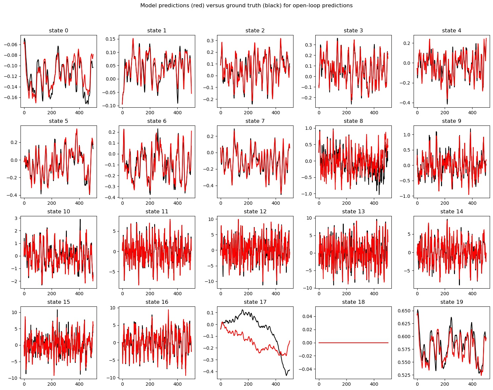

# CS294-112 HW 4: Model Based DRL

See the [HW4 PDF](http://rail.eecs.berkeley.edu/deeprlcourse-fa18/static/homeworks/hw4.pdf) for further instructions.

# Trained Agent 

# Comparison of Learned and Actual Model

# Hyperparameters Tuning

